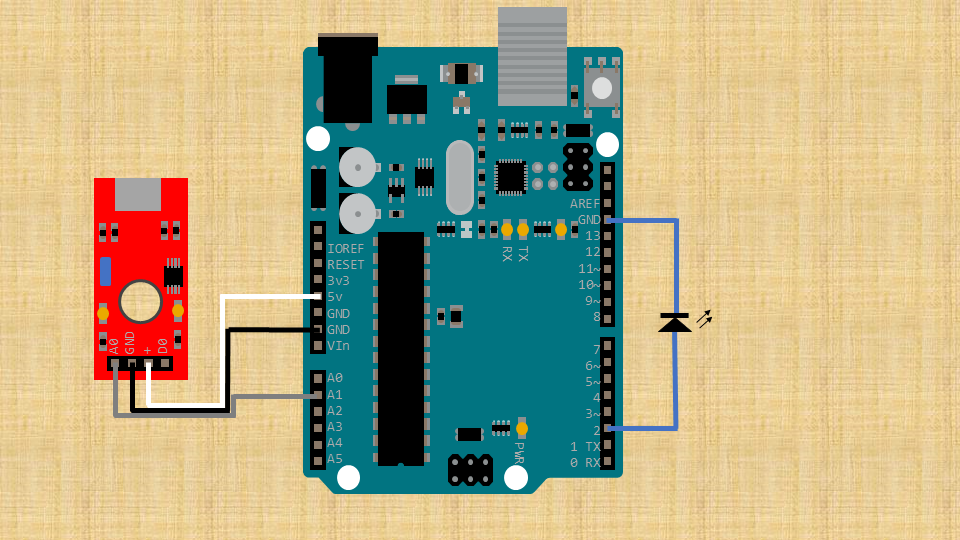

# 使用方法
主文件为NewProject.ino 
接线图如下 
</img>
编译器使用AVRISP mkII 
适用于
- Ardunio Uno family
- Ardunio Uno R4 family

# Update Log
## V0.1 
<small>日期 2024/2/3</small>
- 初始化项目
## V1.1
<small>日期 2024/2/15</small>
- 改进开灯时长,更加贴合使用情况
## V1.2
<small>日期 2024/2/23</small>
- 改进计时器
